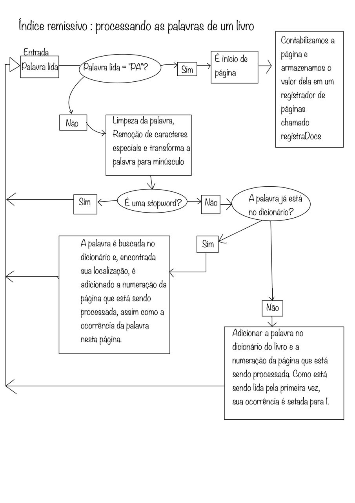
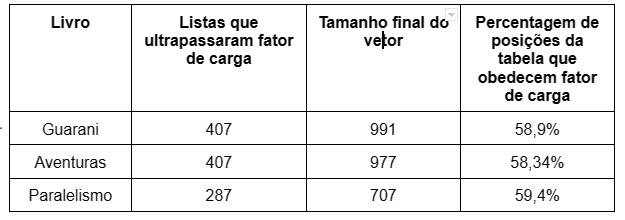
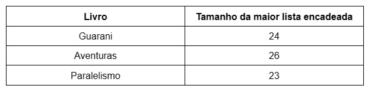

# Relatório sobre o trabalho de Índice remissivo

Membros:
Matheus Souza de Oliveira;
Beatriz Emilly Silva Aguiar;
Felipe Rocha Spitale;
Caio César Macedo Antunes;

O presente trabalho tem como objetivo aplicar um experimento envolvendo o conhecimento adquirido em sala de aula sobre Tabelas Hash. Para isso, criamos um Índice Remissivo, e sua implementação será descrita em maiores detalhes no decorrer desse relatório.

# **1.INTRODUÇÃO**
Índice Remissivo enumera os termos e tópicos que são abordados em um documento junto com suas respectivas páginas. Recomendado para obras cujo texto contenha informações cuja localização é facilitada por este tipo de índice. É análogo a um dicionário ou lista telefônica, em que busca-se uma chave (uma palavra ou número) e toma-se conhecimento de em que página está tal chave, ou seja, trata-se do armazenamento de páginas das chaves de determinada obra. Para entender a complexidade deste assunto é necessário o entendimento de alguns conceitos:

## **Dicionários Estáticos:**
Estrutura fixa e imutável. Quando submetido a buscas tem um excelente desempenho, desde de que seus elementos estejam ordenados e sua implementação é viável através de vetores. Isso permite acesso imediato a todo elemento do dicionário.

## **Dicionários Dinâmicos:**
Construído com completa capacidade de alteração conforme sua necessidade de espaço, ou seja, realiza uma realocação do seu tamanho. As inserções nesta estrutura de dados, bem como buscas e remoções são implementadas por ótimos custos.

## **Tabela Hash:**
Trata-se de uma função de dispersão que mapeia uma chave de busca para um determinado índice da tabela. O objetivo é que a função forneça índices únicos para o conjunto de chaves. Quanto maior o espalhamento mais eficiente serão as operações. Esse espalhamento é priorizado de modo a evitar colisões. A função hash determina também a posição buscada, assim como a posição a ser inserida na tabela, tornando-a determinante para a construção do índice remissivo. As colisões acontecem devido ao mapeamento de duas ou mais chaves para uma mesma posição. O número de colisões depende de como a função espalha os elementos. Devido a isso, a isso, foram aplicados encadeamentos pensando nesse cenário de colisões. Assim, todos os elementos mapeados para uma mesma posição são armazenados em listas encadeadas. Nesse contexto, há um fator de carga que determina uma expectativa de busca no pior cenário de colisões para uma mesma posição.

## **Nível de Agrupamento de Tabela:**

## **TF-IDF:**
É uma medida estatística que tem o intuito de indicar a importância de uma palavra de um documento em relação a um conjunto de documentos. Neste contexto atual, é utilizada como fator de ponderação. O valor TF - IDF de uma palavra cresce conforme aumenta o número de ocorrências dela em um documento, esse valor é estabilizado pela frequência da palavra no documento. Exemplo disso é o quanto uma palavra é vista em uma página, pelo total de páginas do documento, de modo que a relevância dela é observada através desse conceito matemático. 

# **2.OBJETIVOS**
Implementar um programa que gera o índice remissivo de um livro que encontra-se em formato texto. O programa deve retornar até 5 páginas em que a chave ocorre, privilegiando as de maior pontuação do TF-IDF, aplicando os conceitos de Dicionários e Tabela Hash.

## **2.1 OBJETIVOS ESPECÍFICOS**
* Aplicar o conceito de Dicionário, visto em sala de aula;
* Fazer a implementação de uma tabela Hash, de modo a praticar o que foi aprendido em sala de aula;
* Determinar a taxa de ocupação da tabela Hash;
* Comprovar a eficiência da tabela hash em relação ao fator de carga;

#  **3. PROCEDIMENTOS EXPERIMENTAIS**
A seguir estão a listagem dos arquivos criados para estruturar nosso Índice Remissivo:

## **Dicionário Dinâmico:**
É um vetor de listas encadeadas. Além do vetor de listas e o tamanho do vetor, nosso tipo de dicionário dinâmico contém dados que serão utilizados para análise de desempenho no relatório, como: o número de buscas que ocorreu no dicionário, o fator de carga, quantas posições do vetor ultrapassaram o fator de carga, o tamanho da maior lista encadeada no vetor e quantos ReHashes ocorreram no dicionário. 
É através da função Hash que a chave é direcionada e inserida para uma posição do vetor.A função ReHash tenta amenizar o número de colisões, aumentando o número do vetor e mudando o direcionamento de algumas chaves. Ela é invocada quando o nível de agrupamento da tabela (C) é maior que 1. Entretanto, algumas colisões ainda ocorrem, assim como a ultrapassagem do fator de carga.

## **Dicionário Estático:**
Estrutura similar à anterior: um vetor que contém listas encadeadas, de modo que o Dicionário Estático não realiza realocação de memória para inserção de novos elementos. Essa estrutura contém o tamanho e o nível de ocupação de cada posição do vetor, além de um ponteiro que recebe uma função de comparação especificada na “main” e o número de buscas realizadas.
Assim como a estrutura anterior, o Dicionário Estático, ou DE, utiliza uma função hash para posicionar o elemento no vetor. No contexto desse experimento, os elementos inseridos são as palavras de parada, “stop words”, utilizadas como critério para inserção de palavras no Dicionário Dinâmico que as armazena. Em suma, se a palavra buscada estiver no DE, ela não será inserida no DD.
Dessa maneira, o DE contabiliza a quantidade de buscas feitas dentro da estrutura, de modo que tais informações sejam utilizadas neste relatório.

## **Índice Remissivo:**

# **RESULTADOS E DISCUSSÕES**
Tomando a quantidade de palavras de cada livro como referência, têm-se uma média de 11.000 palavras. Se estas fossem postas em um vetor, o número de comparações em uma busca binária seria logarítmo de 11.000 na base 2, o qual resulta em 13. Portanto, como nosso dicionário é um vetor de listas encadeadas, definimos nosso fator de carga como 12, para que o número de comparações nesta busca sequencial seja no máximo 12, obtendo um desempenho melhor que busca binária. 
A tabela a seguir mostra quantas listas encadeadas ultrapassaram o fator de carga:

Com isso, observa-se que não obtivemos o resultado esperado, mas um pouco mais da metade do vetor . Além disso, a maior lista encadeada teve um tamanho de 26. Assim, na pior das hipóteses, fazemos uma busca sequencial de 26 comparações. A tabela a seguir mostra, o tamanho da maior lista encadeada para cada livro:
